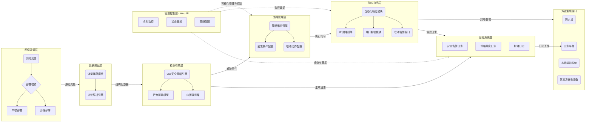

```mermaid
---
config:
  layout: dagre
---
flowchart LR
 subgraph A["网络流量层"]
        A2{"部署模式"}
        A1("网络流量")
        A3["串联部署"]
        A4["旁路部署"]
  end
 subgraph B["数据采集层"]
        B2("协议解析引擎")
        B1("流量捕获模块")
  end
 subgraph C["检测引擎层"]
        C1("yak 安全策略引擎")
        C2["行为驱动模型"]
        C3["内置规则库"]
  end
 subgraph D["策略管理层"]
        D2("触发条件配置")
        D1("策略编排引擎")
        D3("联动动作配置")
  end
 subgraph E["响应执行层"]
        E2("IP 封堵引擎")
        E1("自动化响应模块")
        E3("端口封锁模块")
        E4("联动告警接口")
  end
 subgraph F["外部集成接口"]
        F1("防火墙")
        F2("日志平台")
        F3("态势感知系统")
        F4("第三方安全设备")
  end
 subgraph G["管理控制层 - Web UI"]
        G1["实时监控"]
        G2["状态面板"]
        G3["策略配置"]
  end
 subgraph H["日志系统层"]
        H1["安全告警日志"]
        H2["策略触发日志"]
        H3["封堵日志"]
  end
    A1 --> A2
    A2 --> A3 & A4
    B1 --> B2
    C1 --> C2 & C3
    D1 --> D2 & D3
    E1 --> E2 & E3 & E4
    A -- 原始流量 --> B
    B -- 结构化数据 --> C
    C -- 威胁事件 --> D
    D -- 执行指令 --> E
    E -- 封堵/告警 --> F
    G -. 可视化管理与控制 .-> D
    G -. 监控数据 .-> E
    G -. 查询与展示 .-> H
    C -- 生成日志 --> H
    E -- 生成日志 --> H
    H -- 日志上传 --> F2

```